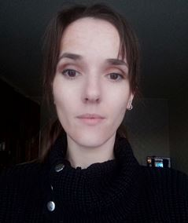

# Oksana Kovsh


HTML coder, front-end developer.
Attentive to detail, I adequately
estimate the time required for the
assigned tasks. Communicative,
good at criticism, with a sense of
humour:)

**********************
## Contacts
+ **Email:** ksanka.kovsh@gmail.com
+ **Phone number:** +375-33-3171791
+ **Discord:** Оксана#1620
+ **Telegram:** @KeepCalmAndCarryOnn

**********************
## About me

I am 31 years old (born 1991), married, have a daughter. I have a
diploma in laboratory nursing (medical and diagnostic, histology).
Since 2018 I have been continuously learning and practicing website
development.
Responsible, always try to immerse myself in the project as much as
possible, quite easy to learn, always focused on results, welcome
teamwork, tactful, not confrontational (but for justice:)).

**********************

## Professional skills

### Website creation
+ Cross-browser adaptive layout of landing-page and multipage websites.
+ Page optimisation according to Google Page speed
+ W3C Markup Validation

### Technology stack used
+ HTML, CSS, JS
+ SASS preprocessor, Gulp
+ BEM methodology
+ Grid, Flexbox
+ Bootstrap
+ Jquery

### Languages 
+ Belarusian - native
+ Russian - native
+ English - intermediate 

**********************
## Training and workshops
+ GloAcademy course - HTML, CSS, WordPress
+ JS basic ITDVN course 
+ Intensive - MODX Basics
+ Roman Trukhtanov CSS animation course
+ Continuous self-study of frontend-development skills
+ English - offline learning with a tutor
+ RS Schools Course «JavaScript/Front-end. Stage 1» (in progress)

**********************
## Code
```
function multiply(a, b){
 return a * b;
}
```
This links in my own projects:

 [https://ksankakovsh.github.io/POS/](https://ksankakovsh.github.io/POS/ "pos")

 [https://ksankakovsh.github.io/wedding/](https://ksankakovsh.github.io/wedding/ "wedding")

 [https://ksankakovsh.github.io/manao/](https://ksankakovsh.github.io/manao/ "manao")


